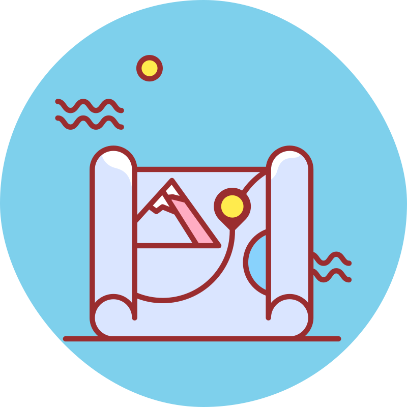

<a name="readme-top"></a>

[![Contributors][contributors-shield]][contributors-url]
[![Forks][forks-shield]][forks-url]
[![Stargazers][stars-shield]][stars-url]
[![Issues][issues-shield]][issues-url]
[![MIT License][license-shield]][license-url]
[![LinkedIn][linkedin-shield]][linkedin-url]

<!-- PROJECT LOGO -->
<br />
<div align="center">
  <a href="https://github.com/MateuszKrolik/TypeScript_Nuxt_Vue_Azure_SocialMedia_FrontEnd">
    
  </a>

<h3 align="center">TypeScript_Nuxt_Vue_Azure_SocialMedia_FrontEnd</h3>

  <p align="center">
    <br />
    <a href="https://github.com/MateuszKrolik/TypeScript_Nuxt_Vue_Azure_SocialMedia_FrontEnd"><strong>Explore the docs »</strong></a>
    <br />
    <br />
    <a href="https://github.com/MateuszKrolik/TypeScript_Nuxt_Vue_Azure_SocialMedia_FrontEnd">View Demo</a>
    ·
    <a href="https://github.com/MateuszKrolik/TypeScript_Nuxt_Vue_Azure_SocialMedia_FrontEnd/issues/new?assignees=&labels=bug&projects=&template=bug-report.md" >Report Bug</a>
    ·
    <a href="https://github.com/MateuszKrolik/TypeScript_Nuxt_Vue_Azure_SocialMedia_FrontEnd/issues/new?assignees=&labels=enhancement&projects=&template=feature-request.md">Request Feature</a>
  </p>
</div>

<!-- TABLE OF CONTENTS -->
<details>
  <summary>Table of Contents</summary>
  <ol>
    <li>
      <a href="#about-the-project">About The Project</a>
      <ul>
        <li><a href="#built-with">Built With</a></li>
      </ul>
    </li>
    <li>
      <a href="#getting-started">Getting Started</a>
      <ul>
        <li><a href="#prerequisites">Prerequisites</a></li>
        <li><a href="#installation">Installation</a></li>
      </ul>
    </li>
    <li><a href="#roadmap--usage">Roadmap</a></li>
    <li><a href="#contributing">Contributing</a></li>
    <li><a href="#license">License</a></li>
    <li><a href="#contact">Contact</a></li>
  </ol>
</details>

<!-- ABOUT THE PROJECT -->

To test out the SSR FrontEnd yourself, you can use the following 😉
link: [Project Link](https://mkrolik-my-places.ashycoast-2fd8c4d9.germanywestcentral.azurecontainerapps.io)

https://github.com/user-attachments/assets/87b83bd6-d4b4-4502-b1b6-a7ca99bc5901

<p align="right">(<a href="#readme-top">back to top</a>)</p>

### Built With

<!-- Programming Languages -->

- [![TypeScript][TypeScript.com]][TypeScript-url]
- [![JavaScript][JavaScript.com]][JavaScript-url]
<!-- Web Technologies -->
- [![Vue][Vue.com]][Vue-url]
- [![Nuxt][Nuxt.com]][Nuxt-url]
- [![Pinia][Pinia.com]][Pinia-url]
- [![Node.js][Nodejs.com]][Nodejs-url]
- [![npm][npm.com]][npm-url]
<!-- Styling-->
- [![Vuetify][Vuetify.com]][Vuetify-url]
- [![Sass][Sass.com]][Sass-url]
- [![Material Design][MaterialDesign.com]][MaterialDesign-url]
- [![HTML5][HTML5.com]][HTML5-url]
- [![CSS3][CSS3.com]][CSS3-url]
<!-- Cloud Deployment Services -->
- [![Azure][Azure.com]][Azure-url]
- [![Azure Container Apps][AzureContainerApps.com]][AzureContainerApps-url]
- [![Azure Resource Manager][AzureResourceManager.com]][AzureResourceManager-url]
- [![Azure Blob Storage][AzureBlobStorage.com]][AzureBlobStorage-url]
- [![GitHub Actions][GitHubActions.com]][GitHubActions-url]
<!-- External APIs -->
- [![SendGrid][SendGrid.com]][SendGrid-url]
- [![Google Maps][GoogleMaps.com]][GoogleMaps-url]
<!-- DevTools -->
- [![Bash][Bash.com]][Bash-url]
- [![Docker][Docker.com]][Docker-url]
- [![Linux][Linux.com]][Linux-url]
- [![Swagger][Swagger.com]][Swagger-url]
- [![.ENV][Dotenv.com]][Dotenv-url]
<!-- DataFormats -->
- [![JSON][JSON.com]][JSON-url]
- [![YAML][YAML.com]][YAML-url]

<p align="right">(<a href="#readme-top">back to top</a>)</p>

<!-- GETTING STARTED -->

## Getting Started

When setting up the project locally, I suggest adding your own custom environment variables via ".env" and "parameters.json" files,
also run chmod +x to make BASH Scripts Executable.

### Prerequisites

You should have Node.js, openapi-generator-cli, DockerDesktop and Azure CLI (Requires Python) installed.

I also suggest having some sort of a linux shell for my BASH Scripts.

### Installation

1. Clone the repo
   ```sh
   git clone https://github.com/MateuszKrolik/TypeScript_Nuxt_Vue_Azure_SocialMedia_FrontEnd.git
   ```

<p align="right">(<a href="#readme-top">back to top</a>)</p>

<!-- ROADMAP & USAGE -->

## Roadmap & Usage

- [x] SSR FrontEnd via:
  - [x] TypeScript
  - [x] Nuxt.js
  - [x] Node.js
  - [x] Vue.js
  - [x] Pinia
- [x] Cookie-based Bearer Token AuthN & AuthZ
- [x] Route authorization via Node.js Reusable Middlewares
- [x] Pinia for App-Wide Auth State Management
- [x] Type-safe OpenApiClient TypeScript Client for Data-Fetching
- [x] Form Validation via Vee-Validate Library
- [x] Routing via Nuxt.js Vue FrameWork
- [x] Loose-Coupling and Abstraction with Reusable Components
- [x] CompositionAPI for reusability via Composables/Hooks
- [x] Reactive programming via Watchers and ComputedProperties
- [x] Material Design Pattern via Vuetify Component Library
- [x] Size-Optimized Docker Image
- [x] DockerHub storage for Docker Image
- [x] Infrastructure-as-Code (IaC) with Azure Resource Manager (ARM) using JSON Deployment Template
- [x] Secure loading of JSON Parameter EnvironmentVariable Secrets during Azure CLI Deployment with BASH Script
- [x] Deployment of the TypeScript Nuxt Vue SSR FrontEnd to Azure Container Apps Service from DockerHub Container Registry via IaC
- [x] CI/CD via GithubActions

See the [open documentation](https://github.com/MateuszKrolik/TypeScript_Nuxt_Vue_Azure_SocialMedia_FrontEnd/issues) for a full
list of proposed features (and
known issues).

<p align="right">(<a href="#readme-top">back to top</a>)</p>

<!-- CONTRIBUTING -->

## Contributing

Contributions are what make the open source community such an amazing place to learn, inspire, and create. Any
contributions you make are **greatly appreciated**.

If you have a suggestion that would make this better, please fork the repo and create a pull request. You can also
simply open an issue with the tag "enhancement".
Don't forget to give the project a star! Thanks again!

1. Fork the Project
2. Create your Feature Branch (`git checkout -b feature/AmazingFeature`)
3. Commit your Changes (`git commit -m 'Add some AmazingFeature'`)
4. Push to the Branch (`git push origin feature/AmazingFeature`)
5. Open a Pull Request

<p align="right">(<a href="#readme-top">back to top</a>)</p>

<!-- LICENSE -->

## License

Distributed under the MIT License. See `LICENSE` for more information.

<p align="right">(<a href="#readme-top">back to top</a>)</p>

<!-- CONTACT -->

## Contact

Mateusz Królik - mateuszkrolik87@gmail.com

Project
Link: [https://mkrolik-my-places.ashycoast-2fd8c4d9.germanywestcentral.azurecontainerapps.io](https://mkrolik-my-places.ashycoast-2fd8c4d9.germanywestcentral.azurecontainerapps.io)

Project Repository
Link: [https://github.com/MateuszKrolik/TypeScript_Nuxt_Vue_Azure_SocialMedia_FrontEnd](https://github.com/MateuszKrolik/TypeScript_Nuxt_Vue_Azure_SocialMedia_FrontEnd)

<p align="right">(<a href="#readme-top">back to top</a>)</p>

<!-- MARKDOWN LINKS & IMAGES -->
<!-- https://www.markdownguide.org/basic-syntax/#reference-style-links -->

[contributors-shield]: https://img.shields.io/github/contributors/MateuszKrolik/TypeScript_Nuxt_Vue_Azure_SocialMedia_FrontEnd.svg?style=for-the-badge
[contributors-url]: https://github.com/MateuszKrolik/TypeScript_Nuxt_Vue_Azure_SocialMedia_FrontEnd/graphs/contributors
[forks-shield]: https://img.shields.io/github/forks/MateuszKrolik/TypeScript_Nuxt_Vue_Azure_SocialMedia_FrontEnd.svg?style=for-the-badge
[forks-url]: https://github.com/MateuszKrolik/TypeScript_Nuxt_Vue_Azure_SocialMedia_FrontEnd/network/members
[stars-shield]: https://img.shields.io/github/stars/MateuszKrolik/TypeScript_Nuxt_Vue_Azure_SocialMedia_FrontEnd.svg?style=for-the-badge
[stars-url]: https://github.com/MateuszKrolik/TypeScript_Nuxt_Vue_Azure_SocialMedia_FrontEnd/stargazers
[issues-shield]: https://img.shields.io/github/issues/MateuszKrolik/TypeScript_Nuxt_Vue_Azure_SocialMedia_FrontEnd.svg?style=for-the-badge
[issues-url]: https://github.com/MateuszKrolik/TypeScript_Nuxt_Vue_Azure_SocialMedia_FrontEnd/issues
[license-shield]: https://img.shields.io/github/license/MateuszKrolik/TypeScript_Nuxt_Vue_Azure_SocialMedia_FrontEnd.svg?style=for-the-badge
[license-url]: https://github.com/MateuszKrolik/TypeScript_Nuxt_Vue_Azure_SocialMedia_FrontEnd/blob/master/LICENSE.txt
[linkedin-shield]: https://img.shields.io/badge/-LinkedIn-black.svg?style=for-the-badge&logo=linkedin&colorB=555
[linkedin-url]: https://www.linkedin.com/in/mateusz-kr%C3%B3lik-8b1862262/
[product-screenshot]: images/screenshot.png
[Linux.com]: https://img.shields.io/badge/Linux-FCC624?style=for-the-badge&logo=linux&logoColor=black
[Linux-url]: https://www.linux.org/
[Docker.com]: https://img.shields.io/badge/Docker-2496ED?style=for-the-badge&logo=docker&logoColor=white
[Docker-url]: https://www.docker.com/
[Swagger.com]: https://img.shields.io/badge/Swagger-85EA2D?style=for-the-badge&logo=swagger&logoColor=black
[Swagger-url]: https://swagger.io/
[Dotenv.com]: https://img.shields.io/badge/.ENV-ECD53F?style=for-the-badge&logo=dotenv&logoColor=black
[Dotenv-url]: https://github.com/theskumar/python-dotenv
[JSON.com]: https://img.shields.io/badge/JSON-000000?style=for-the-badge&logo=json&logoColor=white
[JSON-url]: https://www.json.org/
[YAML.com]: https://img.shields.io/badge/YAML-000000?style=for-the-badge&logo=yaml&logoColor=white
[YAML-url]: https://yaml.org/
[Bash.com]: https://img.shields.io/badge/Bash-4EAA25?style=for-the-badge&logo=gnu-bash&logoColor=white
[Bash-url]: https://www.gnu.org/software/bash/
[Azure.com]: https://img.shields.io/badge/Azure-0089D6?style=for-the-badge&logo=microsoft-azure&logoColor=white
[Azure-url]: https://azure.microsoft.com/
[AzureSQLDatabase.com]: https://img.shields.io/badge/Azure_SQL_Database-CC2927?style=for-the-badge&logo=microsoft-sql-server&logoColor=white
[AzureSQLDatabase-url]: https://azure.microsoft.com/products/azure-sql/database/
[AzureBlobStorage.com]: https://img.shields.io/badge/Azure_Blob_Storage-0089D6?style=for-the-badge&logo=microsoft-azure&logoColor=white
[AzureBlobStorage-url]: https://azure.microsoft.com/services/storage/blobs/
[AzureContainerApps.com]: https://img.shields.io/badge/Azure_Container_Apps-38A169?style=for-the-badge
[AzureContainerApps-url]: https://azure.microsoft.com/services/container-apps/
[GoogleMaps.com]: https://img.shields.io/badge/Google_Maps-ED8936?style=for-the-badge
[GoogleMaps-url]: https://developers.google.com/maps
[SendGrid.com]: https://img.shields.io/badge/SendGrid-9F7AEA?style=for-the-badge
[SendGrid-url]: https://sendgrid.com/
[AzureResourceManager.com]: https://img.shields.io/badge/Azure_Resource_Manager-48BB78?style=for-the-badge
[AzureResourceManager-url]: https://docs.microsoft.com/en-us/azure/azure-resource-manager/
[Vue.com]: https://img.shields.io/badge/Vue-4FC08D?style=for-the-badge&logo=vue.js&logoColor=white
[Vue-url]: https://vuejs.org/
[Nuxt.com]: https://img.shields.io/badge/Nuxt-00C58E?style=for-the-badge&logo=nuxt.js&logoColor=white
[Nuxt-url]: https://nuxtjs.org/
[Vuetify.com]: https://img.shields.io/badge/Vuetify-1867C0?style=for-the-badge&logo=vuetify&logoColor=white
[Vuetify-url]: https://vuetifyjs.com/
[MaterialDesign.com]: https://img.shields.io/badge/Material_Design-757575?style=for-the-badge&logo=material-design&logoColor=white
[MaterialDesign-url]: https://material.io/design
[TypeScript.com]: https://img.shields.io/badge/TypeScript-3178C6?style=for-the-badge&logo=typescript&logoColor=white
[TypeScript-url]: https://www.typescriptlang.org/
[Sass.com]: https://img.shields.io/badge/Sass-CC6699?style=for-the-badge&logo=sass&logoColor=white
[Sass-url]: https://sass-lang.com/
[Nodejs.com]: https://img.shields.io/badge/Node.js-339933?style=for-the-badge&logo=node.js&logoColor=white
[Nodejs-url]: https://nodejs.org/
[npm.com]: https://img.shields.io/badge/npm-CB3837?style=for-the-badge&logo=npm&logoColor=white
[npm-url]: https://www.npmjs.com/
[JavaScript.com]: https://img.shields.io/badge/JavaScript-F7DF1E?style=for-the-badge&logo=javascript&logoColor=black
[JavaScript-url]: https://developer.mozilla.org/en-US/docs/Web/JavaScript
[HTML5.com]: https://img.shields.io/badge/HTML5-E34F26?style=for-the-badge&logo=html5&logoColor=white
[HTML5-url]: https://developer.mozilla.org/en-US/docs/Web/Guide/HTML/HTML5
[CSS3.com]: https://img.shields.io/badge/CSS3-1572B6?style=for-the-badge&logo=css3&logoColor=white
[CSS3-url]: https://developer.mozilla.org/en-US/docs/Web/CSS/CSS3
[Pinia.com]: https://img.shields.io/badge/Pinia-2D3748?style=for-the-badge&logo=data:image/svg+xml;base64,PHN2ZyB4bWxucz0iaHR0cDovL3d3dy53My5vcmcvMjAwMC9zdmciIHdpZHRoPSIwLjc4ZW0iIGhlaWdodD0iMWVtIiB2aWV3Qm94PSIwIDAgMjU2IDMzMSI+PGRlZnM+PGxpbmVhckdyYWRpZW50IGlkPSJsb2dvc1BpbmlhMCIgeDE9IjU1LjM0MiUiIHgyPSI0Mi44MTclIiB5MT0iMCUiIHkyPSI0Mi44NjMlIj48c3RvcCBvZmZzZXQ9IjAlIiBzdG9wLWNvbG9yPSIjNTJjZTYzIi8+PHN0b3Agb2Zmc2V0PSIxMDAlIiBzdG9wLWNvbG9yPSIjNTFhMjU2Ii8+PC9saW5lYXJHcmFkaWVudD48bGluZWFyR3JhZGllbnQgaWQ9ImxvZ29zUGluaWExIiB4MT0iNTUuMzQ5JSIgeDI9IjQyLjgwOCUiIHkxPSIwJSIgeTI9IjQyLjg2MyUiPjxzdG9wIG9mZnNldD0iMCUiIHN0b3AtY29sb3I9IiM1MmNlNjMiLz48c3RvcCBvZmZzZXQ9IjEwMCUiIHN0b3AtY29sb3I9IiM1MWEyNTYiLz48L2xpbmVhckdyYWRpZW50PjxsaW5lYXJHcmFkaWVudCBpZD0ibG9nb3NQaW5pYTIiIHgxPSI1MCUiIHgyPSI1MCUiIHkxPSIwJSIgeTI9IjU4LjgxMSUiPjxzdG9wIG9mZnNldD0iMCUiIHN0b3AtY29sb3I9IiM4YWU5OWMiLz48c3RvcCBvZmZzZXQ9IjEwMCUiIHN0b3AtY29sb3I9IiM1MmNlNjMiLz48L2xpbmVhckdyYWRpZW50PjxsaW5lYXJHcmFkaWVudCBpZD0ibG9nb3NQaW5pYTMiIHgxPSI1MS4zNzglIiB4Mj0iNDQuNTg1JSIgeTE9IjE3LjQ3MyUiIHkyPSIxMDAlIj48c3RvcCBvZmZzZXQ9IjAlIiBzdG9wLWNvbG9yPSIjZmZlNTZjIi8+PHN0b3Agb2Zmc2V0PSIxMDAlIiBzdG9wLWNvbG9yPSIjZmZjNjNhIi8+PC9saW5lYXJHcmFkaWVudD48L2RlZnM+PHBhdGggZmlsbD0idXJsKCNsb2dvc1BpbmlhMCkiIGQ9Ik02Ny41NiAxNzMuMzI4YzMwLjM2Ni0yLjk4NSA0MS4wOC0yNy42NDggNDQuNzM1LTY0LjgyM2MzLjY1NC0zNy4xNzUtMjEuMTc0LTcwLjgxNC0zMS41MDItNjkuNzk5cy00My4xNSA0MC4zMjItNDYuODA1IDc3LjQ5N2MtMy42NTQgMzcuMTc1IDMuMjA1IDYwLjExIDMzLjU3MiA1Ny4xMjUiIHRyYW5zZm9ybT0icm90YXRlKC0zOCA3Mi44NzcgMTA2LjEzNikiLz48cGF0aCBmaWxsPSJ1cmwoI2xvZ29zUGluaWExKSIgZD0iTTE4NC40NTQgMTg2LjI3N2MzMC4zNjcgMi45ODYgMzYuMzk0LTIwLjAzMiAzMi43NC01Ny4yMDdjLTMuNjU1LTM3LjE3NS0zNS42NDUtNzYuNC00NS45NzMtNzcuNDE1cy0zNS45ODkgMzIuNTQyLTMyLjMzNCA2OS43MTdzMTUuMjAxIDYxLjkyIDQ1LjU2NyA2NC45MDUiIHRyYW5zZm9ybT0icm90YXRlKDUyIDE3OC4zNCAxMTkuMDg1KSIvPjxwYXRoIGZpbGw9InVybCgjbG9nb3NQaW5pYTIpIiBkPSJNMTI5LjIzMiAxNTEuNjAxYzI3LjM0MSAwIDM0Ljg3OC0yNi4xODQgMzQuODc4LTY3LjAxM1MxMzguNTMxIDMuNzQ1IDEyOS4yMzIgMy43NDVTOTMuNjA1IDQzLjc1OCA5My42MDUgODQuNTg4YzAgNDAuODI5IDguMjg2IDY3LjAxMyAzNS42MjcgNjcuMDEzIiB0cmFuc2Zvcm09InJvdGF0ZSg3IDEyOC44NTggNzcuNjczKSIvPjxwYXRoIGZpbGw9InVybCgjbG9nb3NQaW5pYTMpIiBkPSJNMTEzLjM4NiAzMzAuMzA3YzU2Ljg5NiAwIDEwMy4wMzgtMTYuNTI4IDEwMy4wMzgtOTEuNDgycy00Ni4xNDItMTM2LjQ2Mi0xMDMuMDM4LTEzNi40NjJjLTU2Ljg5NyAwLTEwMy4wMDIgNjEuNTA3LTEwMy4wMDIgMTM2LjQ2MnM0Ni4xMDUgOTEuNDgyIDEwMy4wMDIgOTEuNDgyIi8+PGVsbGlwc2UgY3g9IjE2NS40MjciIGN5PSIyMTYuNjc3IiBmaWxsPSIjZWFhZGNjIiByeD0iMTQuNzE3IiByeT0iNi44NDUiLz48ZWxsaXBzZSBjeD0iNTcuMjczIiBjeT0iMjEyLjU3IiBmaWxsPSIjZWFhZGNjIiByeD0iMTQuNzE3IiByeT0iNi44NDUiIHRyYW5zZm9ybT0icm90YXRlKDcgNTcuMjczIDIxMi41NykiLz48cGF0aCBkPSJNOTYuMjY2IDIxMC4yODVhMi4wNTQgMi4wNTQgMCAxIDAtMy40MDYgMi4yOTVjMy4xNTEgNC42NzYgNy45OTcgNy4zOSAxNC4zNzMgOC4xMTljNi4zNDguNzI1IDEyLjAxNi0uOTAyIDE2Ljg3Ny00Ljg1MmEyLjA1NCAyLjA1NCAwIDEgMC0yLjU5LTMuMTg3Yy0zLjk5OSAzLjI0OS04LjU2MyA0LjU1OS0xMy44MiAzLjk1OGMtNS4yMy0uNTk4LTguOTg2LTIuNy0xMS40MzQtNi4zMzNNNjUuODE4IDE3OC42M2ExNC42NyAxNC42NyAwIDAgMSAxMC41NTEgMy45NDVhMTQuNjcgMTQuNjcgMCAwIDEgNC42NzIgMTAuMjVhMTQuNjcgMTQuNjcgMCAwIDEtMy45NDUgMTAuNTVhMTQuNjcgMTQuNjcgMCAwIDEtMTAuMjUgNC42NzJhMTQuNjcgMTQuNjcgMCAwIDEtMTAuNTUxLTMuOTQ1YTE0LjY3IDE0LjY3IDAgMCAxLTQuNjctMTAuMjVhMTQuNjcgMTQuNjcgMCAwIDEgMy45NDQtMTAuNTVhMTQuNjcgMTQuNjcgMCAwIDEgMTAuMjQ5LTQuNjcyIi8+PHBhdGggZmlsbD0iI2ZmZiIgZD0iTTY2LjU5IDE5MC45MzJhNC43OTIgNC43OTIgMCAxIDAtOS41NzguMzM2YTQuNzkyIDQuNzkyIDAgMCAwIDkuNTc5LS4zMzYiLz48cGF0aCBkPSJNMTU0Ljk5IDE4Mi4zNjZhMTQuNjcgMTQuNjcgMCAwIDEgMTAuNTUyIDMuOTQ0YTE0LjY3IDE0LjY3IDAgMCAxIDQuNjcgMTAuMjVhMTQuNjcgMTQuNjcgMCAwIDEtMy45NDQgMTAuNTUxYTE0LjY3IDE0LjY3IDAgMCAxLTEwLjI1IDQuNjcxYTE0LjY3IDE0LjY3IDAgMCAxLTEwLjU1LTMuOTQ1YTE0LjY3IDE0LjY3IDAgMCAxLTQuNjcyLTEwLjI1YTE0LjY3IDE0LjY3IDAgMCAxIDMuOTQ1LTEwLjU1YTE0LjY3IDE0LjY3IDAgMCAxIDEwLjI1LTQuNjcxIi8+PHBhdGggZmlsbD0iI2ZmZiIgZD0iTTY1LjcxIDE3NS41NTJjOS44MjQtLjM0MyAxOC4wNjYgNy4zNDIgMTguNDA5IDE3LjE2NXMtNy4zNDIgMTguMDY1LTE3LjE2NiAxOC40MDhzLTE4LjA2NC03LjM0Mi0xOC40MDctMTcuMTY2Yy0uMzQzLTkuODIzIDcuMzQxLTE4LjA2NCAxNy4xNjQtMTguNDA3bTEyLjI1MiAxNy4zOGMtLjIyNC02LjQyMy01LjYxMy0xMS40NDgtMTIuMDM3LTExLjIyM2MtNi40MjIuMjI0LTExLjQ0NyA1LjYxMi0xMS4yMjIgMTIuMDM1Yy4yMjQgNi40MjQgNS42MTIgMTEuNDQ4IDEyLjAzNSAxMS4yMjRzMTEuNDQ4LTUuNjEyIDExLjIyNC0xMi4wMzZtNzYuOTIxLTEzLjY0NWM5LjgyNC0uMzQzIDE4LjA2NSA3LjM0MiAxOC40MDggMTcuMTY1cy03LjM0MiAxOC4wNjUtMTcuMTY1IDE4LjQwOHMtMTguMDY1LTcuMzQyLTE4LjQwOC0xNy4xNjVzNy4zNDItMTguMDY1IDE3LjE2NS0xOC40MDhtMTIuMjUxIDE3LjM4Yy0uMjI0LTYuNDIzLTUuNjEyLTExLjQ0Ny0xMi4wMzYtMTEuMjIzcy0xMS40NDggNS42MTMtMTEuMjIzIDEyLjAzNnM1LjYxMiAxMS40NDggMTIuMDM1IDExLjIyNGM2LjQyNC0uMjI1IDExLjQ0OC01LjYxMyAxMS4yMjQtMTIuMDM3Ii8+PHBhdGggZmlsbD0iI2ZmZiIgZD0iTTE1NS43NjMgMTk0LjY2OGE0Ljc5MiA0Ljc5MiAwIDEgMC05LjU3OC4zMzVhNC43OTIgNC43OTIgMCAwIDAgOS41NzgtLjMzNSIvPjxwYXRoIGZpbGw9IiNlY2I3MzIiIGQ9Im0zOC4wODMgMjQzLjE2bDIyLjMzIDIzLjIzNWwxNi4wMjItMTcuMDQ0YTMuNzY1IDMuNzY1IDAgMCAxIDUuNDg2IDUuMTU3bC0xNi4yODMgMTcuMzI0bDIzLjEgMjQuMDM2YTMuNzY1IDMuNzY1IDAgMSAxLTUuNDMgNS4yMThsLTIyLjgzNC0yMy43NjFsLTEwLjcyNSAxMS40MWEzLjc2NSAzLjc2NSAwIDEgMS01LjQ4Ni01LjE1OGwxMC45ODYtMTEuNjg4bC0yMi41OTUtMjMuNTExYTMuNzY1IDMuNzY1IDAgMSAxIDUuNDMtNS4yMThtMTQ5Ljk1NiAwYTMuNzY1IDMuNzY1IDAgMSAxIDUuNDI5IDUuMjE4bC0yMi41OTYgMjMuNTExbDEwLjk4OCAxMS42ODhhMy43NjUgMy43NjUgMCAwIDEtLjA0MiA1LjIwMWwtLjEyMy4xMjFhMy43NjUgMy43NjUgMCAwIDEtNS4zMjItLjE2NWwtMTAuNzI1LTExLjQxbC0yMi44MzQgMjMuNzYyYTMuNzY1IDMuNzY1IDAgMCAxLTUuMTk3LjIyMmwtLjEyNy0uMTE2YTMuNzY1IDMuNzY1IDAgMCAxLS4xMDUtNS4zMjRsMjMuMS0yNC4wMzZsLTE2LjI4NC0xNy4zMjRhMy43NjUgMy43NjUgMCAwIDEgLjA0Mi01LjJsLjEyMy0uMTIxYTMuNzY1IDMuNzY1IDAgMCAxIDUuMzIxLjE2NGwxNi4wMjEgMTcuMDQ0eiIvPjxwYXRoIGZpbGw9IiNmZmM3M2IiIGQ9Ik0xMzYuNjAyIDEyNi43NGEzLjc2NSAzLjc2NSAwIDAgMSAwIDUuMzIzbC0xNy41MyAxNy41MzFsMTAuNjg0IDEwLjY4NmEzLjc2NSAzLjc2NSAwIDAgMSAuMTIgNS4ybC0uMTIuMTI1YTMuNzY1IDMuNzY1IDAgMCAxLTUuMzI0IDBsLTEwLjY4Ni0xMC42ODZsLTEwLjY4NiAxMC42ODZhMy43NjUgMy43NjUgMCAxIDEtNS4zMjQtNS4zMjVsMTAuNjg1LTEwLjY4NmwtMTcuNTMtMTcuNTNhMy43NjUgMy43NjUgMCAwIDEtLjEyLTUuMmwuMTItLjEyNWEzLjc2NSAzLjc2NSAwIDAgMSA1LjMyNCAwbDE3LjUzMSAxNy41M2wxNy41MzEtMTcuNTNhMy43NjUgMy43NjUgMCAwIDEgNS4zMjUgMCIvPjwvc3ZnPg==
[Pinia-url]: https://pinia.vuejs.org/
[GitHubActions.com]: https://img.shields.io/badge/GitHub_Actions-2088FF?style=for-the-badge&logo=github-actions&logoColor=white
[GitHubActions-url]: https://github.com/features/actions
